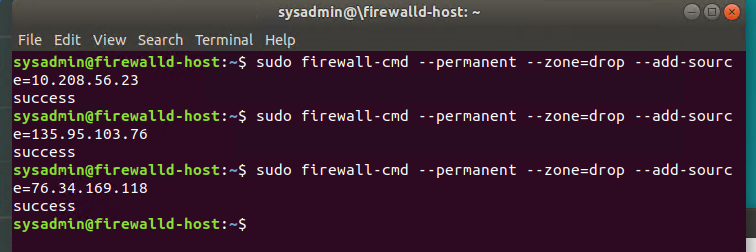

Unit 11 Submission File: Network Security Homework

## Part 1: Review Questions

## Security Control Types
The concept of defense in depth can be broken down into three different security control types. Identify the security control type of each set  of defense tactics.

1. Walls, bollards, fences, guard dogs, cameras, and lighting are what type of security control?

## Answer: 
Physical security

2. Security awareness programs, BYOD policies, and ethical hiring practices are what type of security control?

## Answer:
 Administrative Security 

3. Encryption, biometric fingerprint readers, firewalls, endpoint security, and intrusion detection systems are what type of security control?

## Answer:
Operational Security

## Intrusion Detection and Attack indicators

1. What's the difference between an IDS and an IPS?

## Answer:
IPS logs & takes action against potential threat traffic, IDS does not.
to expline, IDS is a stateless network monitor, which doesn't alter packets
or frames, but rather logs and/or notifies individuals about network
traffic.  An IPS; however, plays a more active role in network monitoring.
Being a stateful control system, an IPS is capable of blocking traffic and
intializing other security protocols.

2. What's the difference between an Indicator of Attack and an Indicator of Compromise?

## Answer:
Indicator of attacks are real time indicators, or a breach indicators of compromise are like attamted attack.
to expline, An indicator of compromise focuses on gathering conclusive evidence,
that a system has been breached, while an indicator of attack focuses on
spotting attempted attacks or reconaissance and deducing the actor's intent.
Modern security tools tend to aim more on indicators of attack

## The Cyber Kill Chain

Name each of the seven stages for the Cyber Kill chain and provide a brief example of each.

## Answer

Stage 1: Recon - Gathering info on an individual in preparation for an attack.

Stage 2: Weaponization - Injecting the malicious software or installing some sort of back door on said target's machine.

Stage 3: Delivery - Attacker sends malicious payload by means of email or instant message.

Stage 4: Exploitation - Gaining access & compromising the user's machine.

Stage 5: Installation - Installing more malicious code such as granting your own user root access.

Stage 6: C2 - Command channel used to control another computer.

Stage 7: Exfiltration - Accomplishing the final goal on the user's machine.

## Snort Rule Analysis
Use the Snort rule to answer the following questions:
Snort Rule #1
alert tcp $EXTERNAL_NET any -> $HOME_NET 5800:5820 (msg:"ET SCAN Potential VNC Scan 5800-5820"; flags:S,12; threshold: type both, track by_src, count 5, seconds 60; reference:url,doc.emergingthreats.net/2002910; classtype:attempted-recon; sid:2002910; rev:5; metadata:created_at 2010_07_30, updated_at 2010_07_30;)

1. Break down the Sort Rule header and explain what is happening?

## Answer:

A remote host, using any port, attempted to scan the local host
($HOME_NET) on ports ranging from 5800 to 5820, using TCP/IP protocol.  This
is likely the result of port mapping with a tool such as nmap or metasploit.

2. What stage of the Cyber Kill Chain does this alert violate?

## Answer:

Reconnaissance

3. What kind of attack is indicated?

## Answer:

Port Mapping

## Snort Rule #2

alert tcp $EXTERNAL_NET $HTTP_PORTS -> $HOME_NET any (msg:"ET POLICY PE EXE or DLL Windows file download HTTP"; flow:established,to_client; flowbits:isnotset,ET.http.binary; flowbits:isnotset,ET.INFO.WindowsUpdate; file_data; content:"MZ"; within:2; byte_jump:4,58,relative,little; content:"PE|00 00|"; distance:-64; within:4; flowbits:set,ET.http.binary; metadata: former_category POLICY; reference:url,doc.emergingthreats.net/bin/view/Main/2018959; classtype:policy-violation; sid:2018959; rev:4; metadata:created_at 2014_08_19, updated_at 2017_02_01;)

1. Break down the Sort Rule header and explain what is happening? 

## Answer:

The remote host, through http ports, attempted to deliver a malicous
payload to any port of the local machine.

2. What layer of the Defense in Depth model does this alert violate?

### Answer:

Delivery

3. What kind of attack is indicated?

### Answer:

Cross site scripting

## Snort Rule #3

Your turn! Write a Snort rule that alerts when traffic is detected inbound on port 4444 to the local network on any port. Be sure to include the msg in the Rule Option.

### Answer:

**alert tcp $EXTERNAL_NET any -> $HOME_NET 4444 (msg:"gg no re")**

## Part 2: "Drop Zone" Lab

Log into the Azure firewalld machine
Log in using the following credentials:

Username: sysadmin

Password: cybersecurity

## Uninstall ufw

Before getting started, you should verify that you do not have any instances of ufw running. This will avoid conflicts with your firewalld service. This also ensures that firewalld will be your default firewall.

1. Run the command that removes any running instance of ufw.

### Answer

**sudo apt -y remove ufwD** 

## Enable and start firewalld

1. By default, these service should be running. If not, then run the following 
commands:
Run the commands that enable and start firewalld upon boots and reboots.

### Answer Command

**sudo systemctl enable firewalld**
**sudo systemctl start firewalld**

- 

Note: This will ensure that firewalld remains active after each reboot.

## Confirm that the service is running.

Run the command that checks whether or not the firewalld service is up and running.

### Answer Command

**systemctl status firewalld.service**

## List all firewall rules currently configured.

1. Next, lists all currently configured firewall rules. This will give you a good idea of what's currently configured and save you time in the long run by not doing double work.

Run the command that lists all currently configured firewall rules:

### Answer Command

**sudo firewall-cmd --list-all**

Take note of what Zones and settings are configured. You many need to remove unneeded services and settings.

## List all supported service types that can be enabled.

1. Run the command that lists all currently supported services to see if the service you need is available

### Answer Command

**sudo firewalld-cmd --get-services**

We can see that the Home and Drop Zones are created by default.

## Zone Views

1. Run the command that lists all currently configured zones.

### Answer Command

**sudo firewall-cmd --list-all-zones**

We can see that the Public and Drop Zones are created by default. Therefore, we will need to create Zones for Web, Sales, and Mail.

## Create Zones for Web, Sales and Mail.

1. Run the commands that creates Web, Sales and Mail zones.

### Answer Command

**sudo firewall-cmd --permanent --new-zone=web**
**sudo firewall-cmd --permanent --new-zone=sales**
**sudo firewall-cmd --permanent --new-zone=mail**

## Set the zones to their designated interfaces:

1. Run the commands that sets your eth interfaces to your zones.

### Answer Command

**sudo firewall-cmd --zone=public --change-interface=eth0**
**sudo firewall-cmd --zone=web --change-interface=eth0**
**sudo firewall-cmd --zone=sales --change-interface=eth0**
**sudo firewall-cmd --zone=mail --change-interface=eth0**

## Add services to the active zones:

1. Run the commands that add services to the public zone, the web zone, the sales zone, and the mail zone.

### Public: Answer

**sudo firewall-cmd --zone=public --add-service=http**
**sudo firewall-cmd --zone=public --add-service=https**
**sudo firewall-cmd --zone=public --add-service=pop3**
**sudo firewall-cmd --zone=public --add-service=smtp**

### Web: Answer

**sudo firewall-cmd --zone=web --add-service=http**

### Sales: Answer

**sudo firewall-cmd --zone=sales --add-service=https**

### Mail: Answer 

**sudo firewall-cmd --zone=mail --add-service=smtp**
**sudo firewall-cmd --zone=mail --add-service=pop3**

What is the status of http, https, smtp and pop3?

## Add your adversaries to the Drop Zone.

1. Run the command that will add all current and any future blacklisted IPs to the Drop Zone.

### Answer

**sudo firewall-cmd --permanent --zone=drop --add-source=10.208.56.23**
**sudo firewall-cmd --permanent --zone=drop --add-source=135.95.103.76**
**sudo firewall-cmd --permanent --zone=drop --add-source=76.34.169.118**

## Make rules permanent then reload them:

It's good practice to ensure that your firewalld installation remains nailed up and retains its services across reboots. This ensure that the network remains secured after unplanned outages such as power failures.

1. Run the command that reloads the firewalld configurations and writes it to memory

### Answer

**sudo firewall-cmd--reload**

## View active Zones

Now, we'll want to provide truncated listings of all currently active zones. This a good time to verify your zone settings.

1. Run the command that displays all zone services.

### Answer 

**sudo firewall-cmd -list-all-zones**

## Block an IP address

Use a rich-rule that blocks the IP address 138.138.0.3.

### Answer

**sudo firewall-cmd --zone=public --add-rich-rule='rule family="ipv4" source address="138.138.0.3" reject'**

## Block Ping/ICMP Requests

Harden your network against ping scans by blocking icmp ehco replies.

1. Run the command that blocks pings and icmp requests in your public zone.

### Answer

**sudo firewall-cmd --zone=public --add-icmp-block=echo-reply --add-icmp-block=echo-request**

## Rule Check

Now that you've set up your brand new firewalld installation, it's time to verify that all of the settings have taken effect.

1. Run the command that lists all  of the rule settings. Do one command at a time for each zone.

### Answer 

**sudo firewall-cmd --zone=public --list-all**
**sudo firewall-cmd --zone=web --list-all**
**sudo firewall-cmd --zone=sales --list-all**
**sudo firewall-cmd --zone=mail --list-all**
**sudo firewall-cmd --zone=drop --list-all**

Are all of our rules in place? If not, then go back and make the necessary modifications before checking again.

Congratulations! You have successfully configured and deployed a fully comprehensive firewalld installation.

## Part 3: IDS, IPS, DiD and Firewalls

Now, we will work on another lab. Before you start, complete the following review questions.

## IDS vs. IPS Systems

1. Name and define two ways an IDS connects to a network.
### Answer 1:

NIDS. its Network based detection system that equals monitors network traffic,
looking for abnormal patterns and behaviors.

### Answer 2:
HIDS. Host based detection system that monitors a system,
looking for malicious activity

2. Describe how an IPS connects to a network.

### Answer:

The IPS is usually located in directlly behind the firewall and monitors
traffic for suspicious movement.

3. What type of IDS compares patterns of traffic to predefined signatures and is unable to detect Zero-Day attacks?

### Answer:

stateless IDS is unable to detect zero days, as it compares traffic
form a set of predefined hot and cold lists, and lacks the inherent
functionallity to filter anything outside of those domains.

4. Which type of IDS is beneficial for detecting all suspicious traffic that deviates from the well-known baseline and is excellent at detecting when an attacker probes or sweeps a network?

### Answer:

The statful IDS is usefull in detecting new exploits.  While they are
generally more bloated than their stateless counterparts, they offer a more
robust set of tools in analyzing system traffic.

## Defense in Depth

For each of the following scenarios, provide the layer of Defense in Depth that applies:

1. A criminal hacker tailgates an employee through an exterior door into a secured facility, explaining that they forgot their badge at home.

### Answer:

Administrative Policy

2. A zero-day goes undetected by antivirus software.

### Answer:

Technical Software

3. A criminal successfully gains access to HR’s database.

### Answer:

Technical Network

4. A criminal hacker exploits a vulnerability within an operating system.

### Answer:

Software

5. A hacktivist organization successfully performs a DDoS attack, taking down a government website.

### Answer:

Technical Network

6. Data is classified at the wrong classification level.

### Answer:

Administrative Procedures

7. A state sponsored hacker group successfully firewalked an organization to produce a list of active services on an email server.

### Answer:

Administrative Network

8. Name one method of protecting data-at-rest from being readable on hard drive.

### Answer:

Drive encryption

9. Name one method to protect data-in-transit.

### Answer:

**Data Encryption**

10. What technology could provide law enforcement with the ability to track and recover a stolen laptop.

### Answer:

**Trackers**

11. How could you prevent an attacker from booting a stolen laptop using an external hard drive?

### Answer:

 **Fireware encrypted password**

## Firewall Architectures and Methodologies

1. Which type of firewall verifies the three-way TCP handshake? TCP handshake checks are designed to ensure that session packets are from legitimate sources.

### Answer:

**Stateless Network firewall**

2. Which type of firewall considers the connection as a whole? Meaning, instead of looking at only individual packets, these firewalls look at whole streams of packets at one time.

### Answer:

**Stateful firewall**

3. Which type of firewall intercepts all traffic prior to being forwarded to its final destination. In a sense, these firewalls act on behalf of the recipient by ensuring the traffic is safe prior to forwarding it?

### Answer:

**Proxy Firewall**

4. Which type of firewall examines data within a packet as it progresses through a network interface by examining source and destination IP address, port number, and packet type- all without opening the packet to inspect its contents?

### Answer:

**Packet-filtering firewall**

5. Which type of firewall filters based solely on source and destination MAC address?

### Answer:

**Data link firewall**

## Bonus Lab: "Green Eggs & SPAM"

In this activity, you will target spam, uncover its whereabouts, and attempt to discover the intent of the attacker.
You will assume the role of a Jr. Security administrator working for the Department of Technology for the State of California.
As a junior administrator, your primary role is to perform the initial triage of alert data: the initial investigation and analysis followed by an escalation of high priority alerts to senior incident handlers for further review.
You will work as part of a Computer and Incident Response Team (CIRT), responsible for compiling Threat Intelligence as part of your incident report.

### Threat Intelligence Card

Note: Log into the Security Onion VM and use the following Indicator of Attack to complete this portion of the homework.
Locate the following Indicator of Attack in Sguil based off of the following:

Source IP/Port: 188.124.9.56:80

Destination Address/Port: 192.168.3.35:1035

Event Message: ET TROJAN JS/Nemucod.M.gen downloading EXE payload

Answer the following:

What was the indicator of an attack?

### Answer

Phisical

Hint: What do the details of the reveal?

Answer:

What was the adversarial motivation (purpose of attack)?
Answer:

Describe observations and indicators that may be related to the perpetrators of the intrusion. Categorize your insights according to the appropriate stage of the cyber kill chain, as structured in the following table.

TTP
Example
Findings

Reconnaissance
How did they attacker locate the victim?

Weaponization
What was it that was downloaded?

Delivery
How was it downloaded?

Exploitation
What does the exploit do?

Installation
How is the exploit installed?

Command & Control (C2)
How does the attacker gain control of the remote machine?

Actions on Objectives
What does the software that the attacker sent do to complete it's tasks?

Answer: 

What are your recommended mitigation strategies?
Answer:

List your third-party references.
Answer: